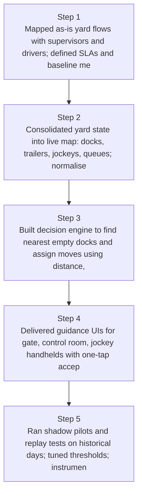
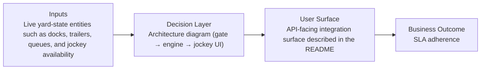
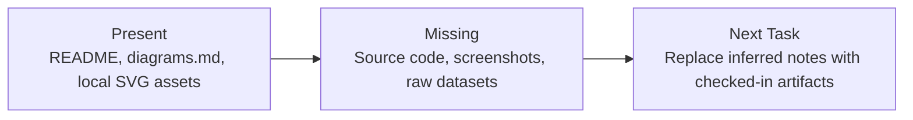

# Adaptive Yard Routing Diagrams

Generated on 2026-04-26T04:29:37Z from README narrative plus project blueprint requirements.

## Yard routing decision flow

## Architecture diagram (gate → engine → jockey UI)

## Evidence Gap Map

